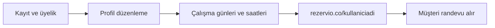

# Rezervio

**Rezervio**, diyetisyen, fizyoterapist, berber, kuaför, psikolog ve benzeri randevu ile çalışan uzmanların müşterilerinden online randevu almasını sağlayan bir **SaaS randevu platformu**dur.

Uzmanlar üyelik satın alır, profil ve çalışma saatlerini tanımlar; ardından kendilerine özel bir rezervasyon sayfası üzerinden müşterileri 7/24 randevu oluşturabilir.

---

## Nasıl çalışır?

### Uzman (işletme sahibi) akışı

1. **Üyelik** — Platforma kayıt olur ve abonelik satın alır.
2. **Aktivasyon** — Ödeme tamamlanınca üyelik aktif hale gelir.
3. **Profil kurulumu** — Ad, iletişim, hizmet bilgileri ve görünüm ayarlarını düzenler.
4. **Çalışma takvimi** — Hangi günlerde ve hangi saat aralıklarında randevu kabul edeceğini seçer.
5. **Kişisel sayfa** — Kurulum bitince `rezervio.co/{kullaniciadi}` adresinde yayına alınan randevu sayfası atanır.

### Müşteri akışı

1. Uzmanın paylaştığı linki açar (`rezervio.co/{kullaniciadi}`).
2. Uygun gün ve saati seçer.
3. Randevusunu onaylar (ileride WhatsApp hatırlatma vb. entegrasyonlar).



---

## Kimler için?

| Sektör | Örnek kullanım |
|--------|----------------|
| Sağlık ve wellness | Diyetisyen, fizyoterapist, psikolog |
| Güzellik | Berber, kuaför, estetisyen |
| Danışmanlık | Koç, danışman, eğitmen |

Her uzman kendi müsaitlik takvimine göre müşterilerine **tek link** üzerinden randevu sunar; telefon trafiği ve manuel takvim yükü azalır.

---

## Bu repoda ne var?

Şu an bu depo **pazarlama / landing** tarafını içerir:

- Ana sayfa hero bölümü (randevu mockup'ı, CTA)
- Header ve footer
- Türkçe arayüz metinleri

Planlanan modüller (ayrı ekranlar ve API entegrasyonu ile gelecek):

- Kayıt, giriş ve abonelik yönetimi
- Uzman paneli (profil + çalışma saatleri)
- Herkese açık randevu sayfası (`/{kullaniciadi}`)
- Randevu oluşturma ve bildirimler

---

## Teknoloji

| Alan | Seçim |
|------|--------|
| Framework | [Next.js](https://nextjs.org) 16 (App Router) |
| UI | React 19, Tailwind CSS 4 |
| Form ve doğrulama | React Hook Form, Zod |
| Veri / state | TanStack Query, Zustand |
| HTTP | Axios |
| Dil | TypeScript |

---

## Proje yapısı

```
frontend-rezervio/
├── app/                    # Next.js App Router (layout, ana sayfa)
├── components/
│   ├── layout/             # Header, Footer, navigasyon
│   └── sections/
│       └── homepage/hero/  # Landing hero + randevu mockup bileşenleri
├── types/                  # Paylaşılan TypeScript tipleri
└── public/                 # Statik dosyalar
```

---

## Kurulum

Gereksinimler: **Node.js 20+**, npm (veya pnpm / yarn).

```bash
# Bağımlılıkları yükle
npm install

# Geliştirme sunucusu (http://localhost:3000)
npm run dev

# Production build
npm run build
npm start

# Lint
npm run lint
```

---

## Ortam değişkenleri

Backend ve ödeme entegrasyonları eklendiğinde `.env.local` örneği:

```env
# API taban URL (örnek)
NEXT_PUBLIC_API_URL=https://api.rezervio.co

# Ödeme / auth vb. (ileride)
# STRIPE_SECRET_KEY=
```

Şu an zorunlu env tanımı yoktur; landing sayfası yerel olarak `npm run dev` ile çalışır.

---

## Yol haritası

- [ ] Kayıt / giriş ve abonelik (Stripe veya yerel ödeme)
- [ ] Uzman onboarding: profil + çalışma günleri / slotlar
- [ ] Dinamik randevu sayfası: `/{kullaniciadi}`
- [ ] Müşteri randevu akışı ve onay e-postası / WhatsApp
- [ ] Uzman paneli: randevu listesi, iptal, müsaitlik güncelleme

---

## Lisans

Özel proje — dağıtım hakları proje sahibine aittir.
